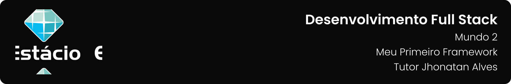

---

[Projeto](#-projeto) • [Como baixar e executar](#-como-baixar-e-executar) • [Aplicações](#-aplicações) • [Tecnologias utilizadas](#-tecnologias-utilizadas) • [Autor](#-autor) • [Licença](#-licença)

---

## 📋 Projeto

Missão Prática com o objetivo de criação de front-end web com base em React ou Next.js, com utilização de bases de teste JSON, em memória, para ambas as plataformas apresentada no **`Nível 3: Meu Primeiro Framework`** do **`Mundo 2`** do curso de **`Desenvolvimento Full Stack da Estácio`**, do semestre de **`2023.2`**, sob a tutoria de Jhonatan Alves.

Projeto elaborado de acordo com as diretrizes especificadas para a Missão Prática, que podem ser conferidas [**`clicando aqui`**](https://sway.office.com/s/fr8v8Z3T3MACYTV1/embed).

## 📥 Como baixar e executar

Para baixar os arquivos deste repositório, você deve ter o [GitHub](https://github.com/) instalado em seu dispositivo.

Após instalado, você deverá acessar a guia `Arquivo` → `Clonar repositório` → `URL` e incluir o caminho `guedesert/meu-primeiro-site-cringe`.

Além disso, é interessante que você tenha um bom editor para trabalhar com os códigos, dos quais eu recomendo o uso do, [Visual Studio Code](https://code.visualstudio.com/).

## 🔗 Aplicações

Durante o projeto foram desenvolvidas 02 aplicações descritas abaixo:

<table>
  <tr>
    <th>Aplicação</th>
    <th>Descrição</th>
  </tr>
  <tr>
    <td>Livros React</td>
    <td>
      <ul>
        <li>Crie um projeto React usando create-react-app.</li>
        <li>Estruture entidades Editora e Livro.</li>
        <li>Codifique controladores de Editoras e Livros.</li>
        <li>Implemente o componente LinhaLivro.</li>
        <li>Crie a página LivroLista para listar livros.</li>
        <li>Implemente a página LivroDados para cadastrar livros.</li>
        <li>Utilize o pacote react-router-dom para navegação entre páginas.</li>
      </ul>
    </td>
  </tr>
  <tr>
    <td>Livros Next</td>
    <td>
      <ul>
        <li>Crie um projeto Next JS usando create-next-app.</li>
        <li>Configure as classes do projeto livros-react no diretório classes de livros-next.</li>
        <li>Implemente APIs internas para gerenciamento de editoras e livros em pages/api.</li>
        <li>Crie as páginas LivroLista e LivroDados dentro do diretório pages.</li>
        <li>Utilize o Hook useEffect para carregar dados assincronamente.</li>
        <li>Integre as páginas com a API interna via fetch.</li>
      </ul>
    </td>
  </tr>
</table>

Ambos os projetos devem ter funcionalidades de listagem, cadastro e navegação entre páginas, usando React/Next.js e Bootstrap.

## 🛠 Tecnologias utilizadas

Para a construção e execução do projeto foram utilizadas as seguintes tecnologias:

  

## 👥 Autor

| Aluno                                                  | Matrícula    | E-mail                                          |
| ------------------------------------------------------ | ------------ | ----------------------------------------------- |
| [Emanuel Roseira Guedes](https://github.com/guedesert) | 202212181407 | [📧](mailto:202212181407@alunos.estacio.br) |

## 📃 Licença

Este repositório está licensiado sob a [Licença MIT](./LICENSE).

